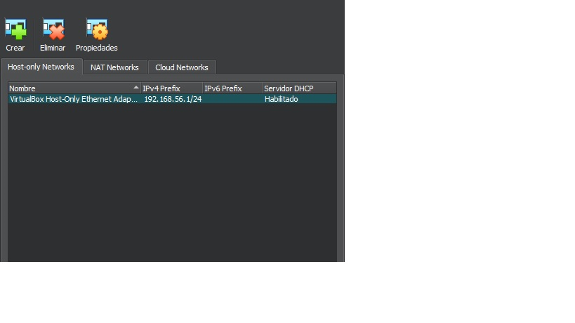

#  Workshop01 - Bookworm con Vagrant

## Instalacion de VirtualBox

- [Descargar VirtualBox](https://www.virtualbox.org/wiki/Downloads)

## Instalacion Vagrant

- [Descargar VirtualBox](https://www.vagrantup.com/downloads)

## Aprovisionar maquina Debian

```bash
cd ~
mkdir -p ISW811/VMs/webserver
cd ISW811/VMs/webserver
```

Ahora creamos el VagrantFile

```bash
vagrant init debian/bookworm64
```

Luego editamos el Vagrantfile. Vamos a editar y descomentar la linea 35, dejandola de
la siguiente manera:
```bash
config.vm.network "private_network", ip: "192.168.56.10"
```

Antes de lanzar el aprovisionamiento de la maquina virtual debemos asegurarnos de que a nivel de VirtualBox
exista la definicion de la `vboxnet` de la red privada que se desea utilizar con la maquina Vagrant.




