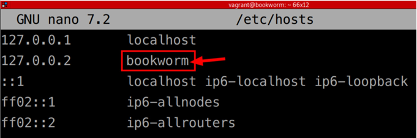
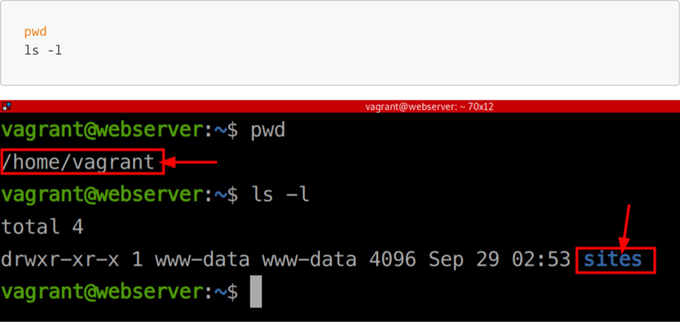
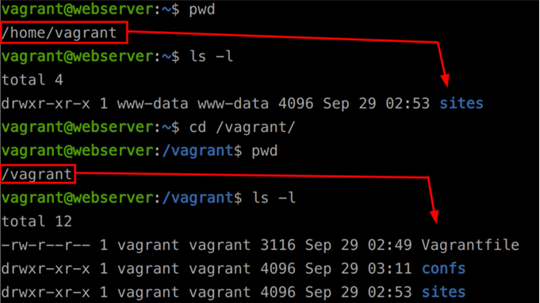
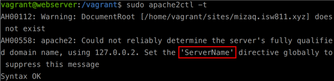
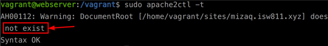
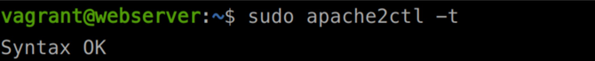
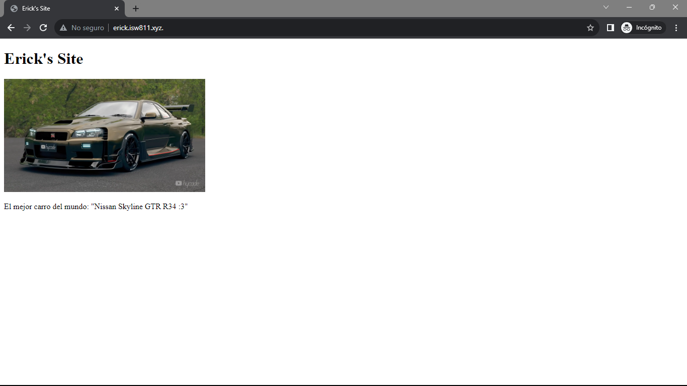

#  Workshop02 - Implementación de LAMP en Bookworm_Erick Arguello

## Cambiar el hostname de la maquina Bookworm

Una vez conectado a la máquina virtual, vamos a cambiar el nombre del host, con el siguiente comando.

```bash
sudo hostnamectl set-hostname webserver
```
Para continuar con el cambio de nombre de host, vamos a editar el archivo /etc/hosts modificando la entrada que dice bookworm por el nuevo nombre del host, en este caso, webserver.

Salvamos con [Ctr1+O] y salimos con [Ctr1+X] 



Para finalizar hacemos logout login 

```bash
exit 
vagrant shh
```
## Instalar paquetes en Debian

Antes de instalar cualquier paquete es necesario actualizar la lista de paquetes disponibles.

```bash
sudo apt-get update
```
Ahora procedemos a instalar Apache2, PHP, MySQL y otros paquetes útiles.

```bash
sudo apt-get install vim vim-nox curl apache2 mariadb-server mariadb-client php8.2 php8.2-cur1 php8.2-bcmath php8.2-mysq1 php8.2-mcrypt php8.2-xm1 php8.2-zip php8.2mbstring
```
## Configurar entrada el hostfile

El primer paso es comprobar que podemos ver la máquina virtual a través de la IP de su red de Host Olny
Network.

```bash
ping 192.168.56.10
```

Ahora vamos a editar el hostfile. Si estás en una máquina anfitriona tipo Windows, debes abrir una terminal de Símbolo del Sistema en modo Administrador (con privilegios elevados); al hacerlo la ventana abrirá en la ubicación c: \windows\system32 por lo que para llegar a la ruta c: \windows\system32\drivers\etc\ solo tendrás que ejecutar los siguientes comandos.

```bash
cd drivers 
cd etc 
notepad hosts
```

Si estás en una máquina anfitriona tipo GNU/Linux (eres un crack) deberás ejecutar el siguiente comando.

```bash
sudo nano/etc/hosts
```

En el archivo hosts debemos agregar una entrada para cada dominio que deseemos resolver. En este caso, vamos a agregar una entrada para resolver el domino erick. isw811. xyz hacia el servidor con IP
192. 168. 56. 1@ de la siguiente manera.

```bash
192.168.56.16 erick.isw811.xyz
```

Luego de editar el archivo hosts correspondiente, vamos a comprobar la resolución del nombre de dominio ingresado.

```bash
ping erick.isw811.xyz
```

Para comprobar que llegamos al «default site» de Apache2, desde un navegador en la máquina anfitriona (de preferencia en modo incognito), visitamos la URL http://erick.isw811.xyz.

## Preparar el servidor para hospedar varios sitios

Para utilizar Apache como proxy reverso, para hospedar varios sitios web en la misma IP y en el mismo puerto, vamos a necesitar instalar el módulo vhost alias Podemos aprovechar e instalar rewrite que es un módulo requerido por Frameworks como Laravel, y el módulo ssl que nos permitirá publicar los sitios por medio del protocolo https.

```bash
sudo a2enmod vhost alias rewrite ssl 
sudo systemctl restart apache2
```

## Configurar la sincronización en 2 vías de Vagrant

Desde la máquina anfitriona vamos editar el Vagrantfile para agregar una directiva que se encargará de mapear el folder . /sites hacia la ruta /home/vagrant/sites definiendo tanto para el propietario, como para el grupo, el valor wwww-data que representa al usuario de Apache.

```bash
# config.vm. synced_folder " ../data", " /vagrant_data" 
config.vm. synced_folder "sites", "/home/vagrant/sites" , owner : "www-data" , group: "www-data"
```

Ahora creamos el folder sites estando ubicados a nivel de la carpeta webserver (en la máquina anfitriona), luego apagamos la máquina virtual, la reiniciamos y nos conectamos.

```bash
mkdir sites 
vagrant halt 
vagrant up 
vagrant ssh
```

Al conectarnos en el máquina virtual podemos comprobar que existe la carpeta sites en el home del usuario vagrant, de la siguiente manera.



Nótese que la carpeta sites se encuentra montada en dos ubicaciones. En /vagrant/sites donde le pertenece al usuario y grupo vagrant; y en la ruta /home/vagrant/sites donde le pertenece al usuario y grupo www-data, que corresponde al usuario y grupo de Apache2.



## Configurar nuestro primer vhost

La máquina anfitriona Desde, a nivel de la carpeta webserver vamos a ejecutar los siguientes comandos.

```bash
mkdir confs 
cd confs 
touch erick.isw811.xyz.conf 
code erick.isw811.xyz.conf
```

Desde el editor de VSCode vamos a agregar el siguiente contenido al archivo erick. isw811.xyz.conf 

```bash
<Virtua1Host *:80>
  ServerAdmin webmaster@erick.isw811.xyz 
  ServerName erick.isw811.xyz

  Directorylndex index.php index.html
  DocumentRoot / home/ vagrant/sites/erick.isw811.xyz

  <Directory / home/ vagrant/sites/erick.isw811.xyz>
    Directorylndex index.php index.html
    AllowOverride All
    Require all granted
  </Directory>

ErrorLog ${APACHE LOG DIR}/erick.isw811.xyz.error.10g 
LogLeve1 warn
CustomLog ${APACHE LOG DIR}/erick.isw811.xyz.access.10g combined 
</Virtua1Host>
```

Luego vamos a la máquina virtual y nos movemos a la ruta /vagrant/confs 

```bash
pwd 
cd /vagrant 
cd confs
ls -l
```

Como se muestra en la siguiente imagen, en la ruta /vagrant/confs de la máquina virtual, podemos visualizar el archivo erick. isw811 .xyz . conf el cual editamos desde la máquina anfitriona, en la ruta MISW811/VMs/webserver/confs/erick.isw811.xyz.conf 


Ahora copiamos el archivo desde /vagrant/confs a /etc/apache2/sites-avai1ab1e/, con el siguiente comando.

```bash
sudo cp erick.isw811.xyz.conf/etc/apache2/sites-avai1ab1e/
```

Ahora habilitamos el nuevo sitio.

```bash
sudo a2ensite erick.isw811.xyz.conf
```

Luego hay que verificar que no existan errores, antes de reiniciar Apache2.

```bash
sudo apache2ct1 -t
```

El único error que se muestra, es uno relacionado con la ausencia de la directiva ServerName en el archivo
/etc/apache2/apache2.conf.



Para agregar la directiva al archivo /etc/apache2/apache2.conf podemos utilizar el siguiente comando.

```bash
echo "ServerName webserver"	| sudo tee -a /etc/apache2/apache2.conf
```

Para comprobar que se agregó correctamente, ejecutamos el siguiente comando.

```bash
cat /etc/apache2/apache2.conf | grep ServerName
```

Ahora al lanzar el comando sudo apache2ct1 -t vemos que aparece un error relaciona con la no existencia del folder del sitio / home/ vagrant/ sites/erick. isw811. xyz 



Para corregirlo vamos a crear un sitio web de ejemplo. Desde la måquina anfitriona ejecutamos los siguientes comandos, estando ubicados en el folder webserver 

```bash
cd sites 
mkdir erick.isw811.xyz 
cd erick.isw811.xyz 
touch index.html 
mkdir images 
code index. html
```

La siguiente imagen fue obtenida de internet 
Recuerde salvarla en el folder ~/ISW811/VMs/webserver/sites/erick.isw811.xyz/images/.


El contenido del index.html podría ser algo como el siguiente ejemplo.

```bash
<!DOCTYPE html>
<html lang="en">
<head>
    <meta charset="UTF-8">
    <meta name="viewport" content="width=800px, initial-scale=1.0">
    <title>Erick's Site</title>
</head>
<body>
    <h1>Erick's Site</h1>
    
    <p>
        El mejor carro del mundo: "Nissan Skyline GTR R34 :3"
    </p>
</body>
</html>
```

Volvemos a comprobar la sintaxis hasta obtener un «Syntax Ok».



Finalmente reiniciamos apache en la máquina virtual y comprobamos el sitio desde la máquina anfitriona.

```bash
sudo systemctl restart apache2
```

Finalmente, desde la máquina anfitriona (de preferencia en un navegador en modo incognito), visitamos la URL http://erick.isw811.xyz. El sitio debería verse así.


