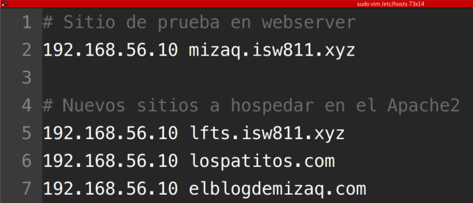
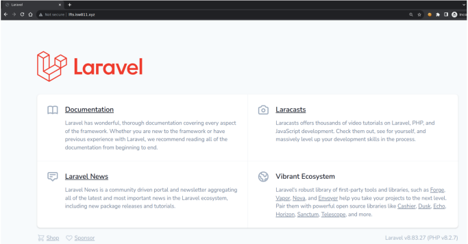

# Workshop03 - Laravel con VHOSTs con Apache


## Agregar los entradas al archivo host de la maquina anfritiona

En la maquina anfitriona vamos a agregar una entrada al archivo hosts por cada dominio que deseamos hospedar en nuestro servidor Apache2.

Para este Workshop vamos a hospedar cuatro dominios, incluyendo el dominio ```mizaq.isw811.xyz.conf``` que configuramos en la clase anterior.

* mizaq.isw811.xyz
* Ifts.isw811.xyz
* lospatitos.com
* elblogdemizaq.com

Así quedarían las entradas en el archivo  ```hosts```.



## Copiar y modificar los archivos de cofiguracion de VHOSTs

```bash
cd MISW811/VMs/webserver 
cd confs 
confs cp mizaq.isw811.xyz.conf Ifts.isw811.xyz.conf 
confs cp mizaq.isw811.xyz.conf lospatitos.com.conf 
confs cp mizaq.isw811.xyz.conf elblogdemizaq.com.conf
```

Luego reemplazamos las entradas ```mizaq``` por las que correspondan al dominio que queremos hospedar.

```bash
sed -i -e 's/mizaq/lfts/g' Ifts.isw811.xyz.conf
sed -i -e 's/mizaq\.isw811\.xyz/lospatitos\.com/g' lospatitos.com.conf
sed	 -i -e 's/mizaq\.isw811\.xyz/elblogdemizaq\.com/g' elblogdemizaq.com.conf
```

Podemos comprobar que los archivos se hayan modificado correctamente con el comando ```cat```

```bash
cat Ifts.isw811.xyz.conf 
cat lospatitos.com.conf 
cat elblogdemizaq.com.conf
```

## Crear el contenido para cada uno de los sitios

El primer paso es crear los directorios que contendrån los sitios.

```bash
cd ~/ISW811/VMs/webserver 
cd sites 
mkdir lospatitos.com 
mkdir elblogdemizaq.com 
mkdir Ifts.isw811.xyz
```

Luego editamos el contenido de cada sitio.

```bash
cd lospatitos.com 
mkdir -p public/assets 
curl -o public/assets/patitos.png 
https://isw811.s3.amazonaws.com/images/patitos.png 
touch index. html 
code index. html
```

En el archivo ```index.html``` vamos agregar el contenido de cada sitio.

```bash
<!DOCTYPE html>
<html lang="en">
<head>
    <meta charset="UTF-8">
    <meta name="viewport" content="width=800px, initial-scale=1.0">
    <title>Los Patitos</title> 
</head>
<body>
    <h1>Site LosPatitos</h1>
    <p>
        Los patitos en el patio
    </p>
    
</body>
</html>
```

## Copiar los archivos de configuración VHOSTS

Desde la máquina, debemos copiar los archivos de configuración de VHOSTS a la ruta de sitios disponibles de Apache2.

```bash
vagrant ssh 
cd /vagrant/confs 
sudo cp elblogdemizaq.com.conf /etc/apache2/sites-avai1ab1e/ 
sudo cp Ifts.isw811.xyz.conf /etc/apache2/sites-avai1ab1e/ 
sudo cp lospatitos.com.conf /etc/apache2/sites-avai1ab1e/ 
sudo cp elblogdemizaq.com.conf /etc/apache2/sites-avai1ab1e/
```

Una forma abreviada de copiar los archivos `conf` al directorio de sitios disponibles de Apache2, es la siguiente. Debemos estar conectados a la máquina virutal, pero el comando se puede lanzar desde cualquier ubicación.

```bash
sudo cp /vagrant/confs/* /etc/apache2/sites-avai1ab1e/
```

## Habilitar los sitios

Cuando los archivos .conf se ha copiado al directorio ```/etc/apache2/sites- available``` se puede proceder con la habilitación de los sitios.

```bash
sudo a2ensite lospatitos.com.conf 
sudo a2ensite elblogdemizaq.com.conf 
sudo a2ensite Ifts.isw811.xyz.conf
```

Los sitios habilitados en el paso anterior no estarán realmente disponibles hasta reiniciar o recargar la configuración de Apache2, 
pero antes de hacerlo es recomendable revisar que no se hayan introducido errores en ninguno de los archivos .conf, esto lo hacemos con el comando sudo ```apache2ct1 -t```

```bash
sudo apache2ct1 -t
```

Si no hay errores, podemos recargar la configuración de Apache2.

```bash
sudo systemctl reload apache2
```

A partir de este punto, desde la máquina anfitriona, podremos explorar los sitios web desde un navegador (se recomienda usar el modo incógnito para evitar errores por caché del navegador).

* [mizaq.isw811.xyz](http://mizaq.isw811.xyz)
* [Ifts.isw811.xyz](http://Ifts.isw811.xyz)
* [lospatitos.com](http://lospatitos.com)
* [elblogdemizaq.com](http://elblogdemizaq.com)

## Instalar Composer
Los dos requisitos indispensables para utilizar el Framework de Laravel son haber instalado en la máquina virtual PHP (que ya lo hicimos) e instalar Composer (el gestor de paquetes de PHP) —también en la máquina virtual—


Estando conectados a la máquina virtual, descargamos el instalador de Composer en el home del usuario, con el siguiente comando.

```bash
cd ~
php -r "copy('https://getcomposer.org/installer', 'composer-setup.php' );"
```

Con PHP generamos el binario de Composer.

```bash
php composer-setup.php
```

Ahora eliminamos el archivo previamente descargado.

```bash
rm composer-setup.php
```

Creamos una carpeta en la ruta `/opt/composer` y movemos ahí el binario de Composer.

```bash
sudo mkdir -p /opt/composer/ 
sudo mv composer.phar /opt/composer/
```

Finalmente, para poder ejecutar Composer desde cualquier ubicación, vamos a crear un enlace símbolico de
Composer en la carpeta `/usr/bin`

```bash
sudo In -s /opt/composer/composer.phar /usr/bin/composer
```

## Crear un sitio con Laravel

Ahora vamos al directorio de sitios para crear un nuevo proyecto a partir de la plantilla de Laravel en su versión 8.6.12. Si no se indica la versión Composer descargará la versión más reciente, pero para el curso de «Laravel From The Scratch 8» se deberá trabajar con la versión 8.6.12.

```bash
cd	/vagrant/sites
```

Eliminamos el proyecto dummy.

```bash
rm -r Ifts.isw811.xyz
```

Creamos el nuevo proyecto con la plantilla de Laravel 8.6.12, utilizando Composer.

```bash
composer create-project larave1/1arave1:8.6.12 Ifts.isw811.xyz
```

## Ajustar el VHOST de Ifts.isw811.xyz

Los sitios Laravel se ejecutan a partir del directorio `./public` por lo cual habrá que modificar el archivo `Ifts.isw811.xyz.`, con lo cual haremos desde la máquina anfitriona.

```bash
cd MISW811/VMs/webserver 
cd confs 
code Ifts.isw811.xyz.conf
```

El contenido del archivo deberá quedar como se muestra a continuación. Nótese que solamente se están modificando la directivas `DocumentRoot y Directory`, a las cuales se les está agregar la cadena / public a la ruta que representa el directorio del sitio.

```bash
<VirtualHost *:80>
  ServerAdmin webmaster@lfts.isw811.xyz
  ServerName lfts.isw811.xyz

  DirectoryIndex index.php index.html
  DocumentRoot /home/vagrant/sites/lfts.isw811.xyz/public

  <Directory /home/vagrant/sites/lfts.isw811.xyz/public>
    DirectoryIndex index.php index.html
     AllowOverride All
     Require all granted
   </Directory>
 
   ErrorLog ${APACHE_LOG_DIR}/lfts.isw811.xyz.error.log
   LogLevel warn
   CustomLog ${APACHE_LOG_DIR}/lfts.isw811.xyz.access.log combined
 </VirtualHost>
```

Luego desde la máquina virtual, hay que actualizar la copia del archivo VHOST que utiliza Apache2.

```bash
cd /vagrant/confs 
sudo cp Ifts.isw811.xyz.conf /etc/apache2/sites-avai1ab1e/
```

Finalmente, debemos recargar la configuración de Apache2.

```bash
sudo systemctl reload apache2
```

A partir de este punto, desde la måquina anfitriona, podremos explorar el nuevo sitio Laravel, utilizando un navegador web (se recomienda usar el modo inc6gnito para evitar errores por caché del navegador).

* [Ifts.isw811.xyz](http://Ifts.isw811.xyz)

Asi se deberia ver el sitio Laravel, en su plantilla versi6n 8.




