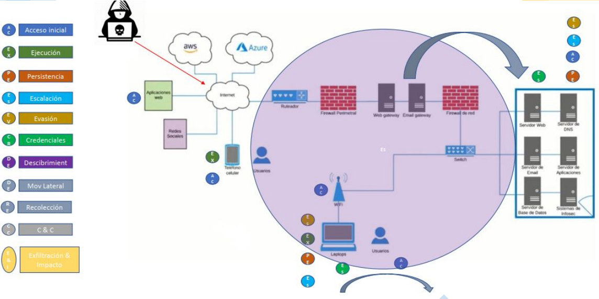

## Taller de NMap, ataque activo a la red

En este taller nos adentramos el tema de la seguridad de la información y ciberseguridad, enfocado en NMAP lo cual es un ataque activo a la red expuesto por Hugo Zamora.

Dada nuestra creciente dependencia de la tecnología en nuestra vida diaria y en nuestros negocios, la seguridad de la información y la ciberseguridad son dos áreas críticas en la actualidad. Estas disciplinas se centran en proteger la confidencialidad, integridad y disponibilidad de la información digital y mitigar los riesgos asociados con las amenazas cibernéticas.

En este taller nos explicaron diversos temas, uno de ellos fue sobre las ramas y salidas profesionales de la ciberseguridad, la cual se ve expuesta en la siguiente imagen.


Además, también nos mencionaron las tres dimensiones de la seguridad de la información, los cuales son:

* Confiabilidad
* Integridad
* Disponibilida

Seguidamente, nos explicaron que el nivel de seguridad de cualquier agente activo está definido por tres componentes, los cuales son los siguientes.


También, nuestro expositor don Hugo nos menciono los motivos, metas y objetivos de un ataque.

Esto nos los explico de la siguiente manera. Que el ataque obviamente tiene que presentar un motivo para realizarlo y para realizar ese ataque hay que tener un paso de métodos para ejecutar el ataque de forma exitosa.

Y nos regalo la siguiente formula por así decirlo.

- `Ataques = Motivo + Método + Vulnerabilidad`

Continuando con el taller, también nos menciono los vectores de ataque y las tácticas de Mitre ATT&CK

* Vectores de ataque.


* Tácticas de Mitre ATT&CK


Además, nos mostraron una imagen la cual hace referencia el paso a paso de la tácticas de Mitre ATT&CK, de como un atacante ejecuta estas tácticas para lograr el daño a los servidores de X empresa



Algunos de los tipos de atacantes o Hackers que se encuentran en este mundo son.

```- Script kiddies
- Hacktivist
- Organized Hacker
- Cyber Terrorist
- Industrial Spies
- State-sponsed Attackers
- Insider Threats
- Suicide Hackers
- Recreational Hackers
```


Además, también nos explicaron sobre el mundo de colores que permanece el los ataques y defensas, el cual es representado de la siguiente manera.


En este taller incluso, nos hablaron sobre `Footprinting` y `OSINT`

Que en resumen, footprinting es la fase de obtención de información y su principal objetivo es obtener información general de la entidad

Y OSINT es el proceso por el cual recopilamos información de fuentes abiertas como los dice su nombre verdad `Open Source Intelligence` en lo que el objetivo es obtener un análisis que nos permitirá generar inteligencia en función a los datos recopilados

Ahora sí, adentramos en el tema de `NMAP` iniciando primero con los tipos de escaneo de este

Unos de los escaneo mas comunes son los siguientes.

* Escaneo de conexion TCP `(-sT)`
* Escaneo UDP `(-sU)`
* Escaneo TCP FIN `(-sF)`
* Escaneo de descubrimiento de host `(-sn)`
* Opciones de sincronización `(-T 0-5)`


También nos explicaron lo que es un escaneo de puertos, los cual es un escaneo activo en el que la herramienta de escaneo envía varios tipos de sondas a la dirección IP de destino y luego examina las respuestas para determinar si el servicio realmente está escuchando.

Una imagen representativa es la siguiente.


En este taller realizamos una actividad para poner en practica el escaneo de puertos con NMAP

Para dar inicio con el actividad nos trasladamos al aplicación `VMware Workstation` y ya dentro de esa maquina virtual abrimos una terminal y ejecutamos lo siguiente para acceder al `root@kali`


Seguidamente, ejecutamos los siguientes comandos primero para ver nuestra ip la cual era `10.60.30.210` y mediante esa ip poder ejecutar el siguiente mostrado en la imagen para buscar que ip poder escanear.


En el taller presentamos problemas a la hora de escanear una ip ya que por el antivirus que tenían las computadoras no podíamos realizar el escaneo.


Pero al final, el expositor Hugo Zamora, permitió que pudiéramos escanear la ip de él la cual era la `10.60.30.242`

Entonces, nos movimos a la siguiente ubicación con el comando `use`


Y se realizo el exploit.


